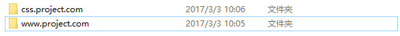
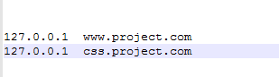
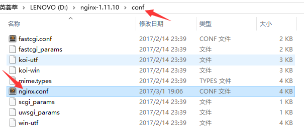
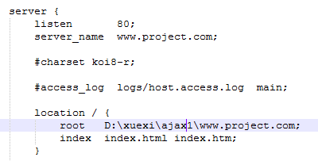
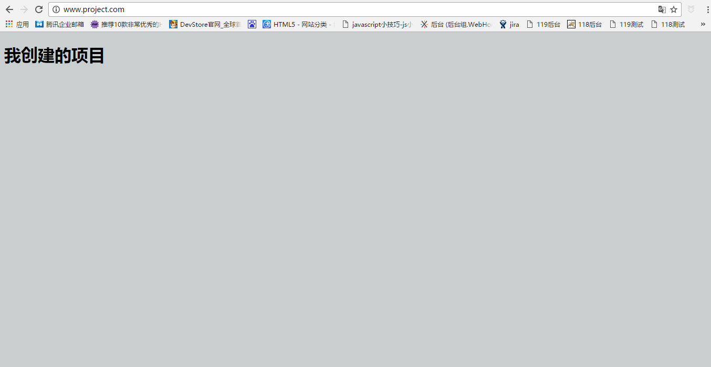

### Ajax的项目搭建
>在搭建Ajax项目之前，首先我们的安装nginx，因为Ajax是基于nginx来运行的，

##### 1.安装nginx 和基本的语法
>http://nginx.org/

上面的nginx的官网，下载直接安装就好了。

###### 语法：
>start nginx  启动
nginx -s stop 停止
nginx -s reload 重启
##### 2.创建Ajax项目
>首先我的在ajax文件夹下新建几个项目如下图：


项目文件下最基本的html 和 css样式。
##### 3.配置Hosts文件
(1)首先我的找到hosts文件
> C:\Windows\System32\drivers\etc

一般用户的hosts文件的路径都是这个。

(2)配置本地地址


127.0.0.1是请求的本地地址。

(3)配置nginx文件


修改nginx.conf文件里面的server

server_name 是你想要请求的地址，
root 是你本地项目的路径

(4)配置css项目。
```
 	server {
        listen       80;
        server_name  css.project.com;

        location / {
            root   D:\xuexi\ajax1\css.project.com;
			index  index.css;
        }
    }
```
然后在nginx下面启动服务。

>start nginx

>##### 启动完成以后，在浏览器上输入http://www.project.com/。



这就是最基本的一个小demo。
